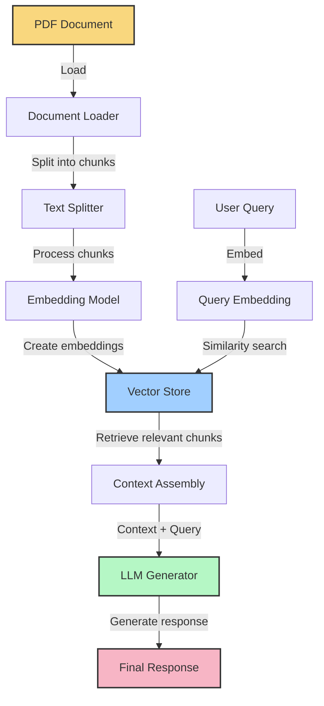

# Advanced RAG Implementation with Node.js

This project demonstrates an advanced implementation of Retrieval-Augmented Generation (RAG) using Node.js and TypeScript. The system processes PDF documents, creates vector embeddings, stores them in a vector database, and generates contextually relevant responses using LLM (Large Language Model).

## Overview

RAG combines the power of retrieval-based and generative AI approaches by:
1. Loading and processing documents
2. Creating vector embeddings of the document content
3. Storing these embeddings in a vector database
4. Retrieving relevant document sections based on user queries
5. Using these retrieved sections as context for AI-driven response generation

## Process Flow Diagram



### Data Flow Stages

1. **Document Processing**
   - PDF document is loaded
   - Text is extracted and split into manageable chunks
   - Chunks are processed to create vector embeddings
   - Embeddings are stored in the vector database

2. **Query Processing**
   - User query is converted to a vector embedding
   - Vector database performs similarity search
   - Most relevant document chunks are retrieved

3. **Response Generation**
   - Retrieved chunks are assembled as context
   - Context and original query are sent to LLM
   - LLM generates contextually informed response

## Project Structure

- `documentLoader.ts` - Handles loading and splitting PDF documents
- `embeddings.ts` - Configures the embedding model for vector creation
- `vectorStore.ts` - Manages the vector database operations
- `generator.ts` - Handles AI-powered response generation
- `main.ts` - Orchestrates the entire workflow

## Workflow

### 1. Document Loading and Processing

The system loads PDF documents (specifically "Pune-Darshan-PDF.pdf" in this example) using the document loader:

```typescript
// Documents are loaded from PDF files
const loader = new PDFLoader("./src/advanced1/Pune-Darshan-PDF.pdf");
const docs = await loader.load();

// Documents are split into manageable chunks
const textSplitter = new RecursiveCharacterTextSplitter({
  chunkSize: 1000,
  chunkOverlap: 200,
});
const splitDocs = await textSplitter.splitDocuments(docs);
```

### 2. Creating and Storing Vector Embeddings

The document chunks are converted to vector embeddings using an embedding model and stored in a vector database:

```typescript
// Initialize the embedding model
const embeddings = new OpenAIEmbeddings();

// Create or load the vector store
const vectorStore = await MemoryVectorStore.fromDocuments(
  splitDocs,
  embeddings
);
```

### 3. Retrieving Relevant Context

When a user query is received, the system retrieves the most relevant document chunks:

```typescript
// Perform similarity search to find relevant documents
const retrievedDocs = await vectorStore.similaritySearch(query, k);
```

### 4. Generating Contextual Responses

The retrieved document chunks are used as context for generating responses:

```typescript
// Generate a response using the retrieved documents as context
const response = await generateResponse(query, retrievedDocs);
```

### 5. Complete Workflow

The `main.ts` file orchestrates the entire process, from document loading to response generation:

- Load and process documents
- Create and store vector embeddings
- Accept user queries
- Retrieve relevant context
- Generate and return responses

## Getting Started

1. Install dependencies:
   ```bash
   npm install
   ```

2. Set up your environment variables (OpenAI API key, etc.)

3. Run the application:
   ```bash
   npm start
   ```

4. Try asking questions about Pune to see the system in action!

## Example Queries

- "What are the popular tourist attractions in Pune?"
- "Tell me about the history of Pune"
- "What is the significance of Shaniwar Wada?"

## Technologies Used

- **LangChain.js** - Framework for building LLM applications
- **OpenAI** - For embeddings and text generation
- **Node.js & TypeScript** - Runtime and language
- **Vector Store** - For similarity search and retrieval

## Advanced Features

- Chunk management with overlapping to maintain context
- Similarity search with configurable result count
- Contextual response generation using retrieved documents
